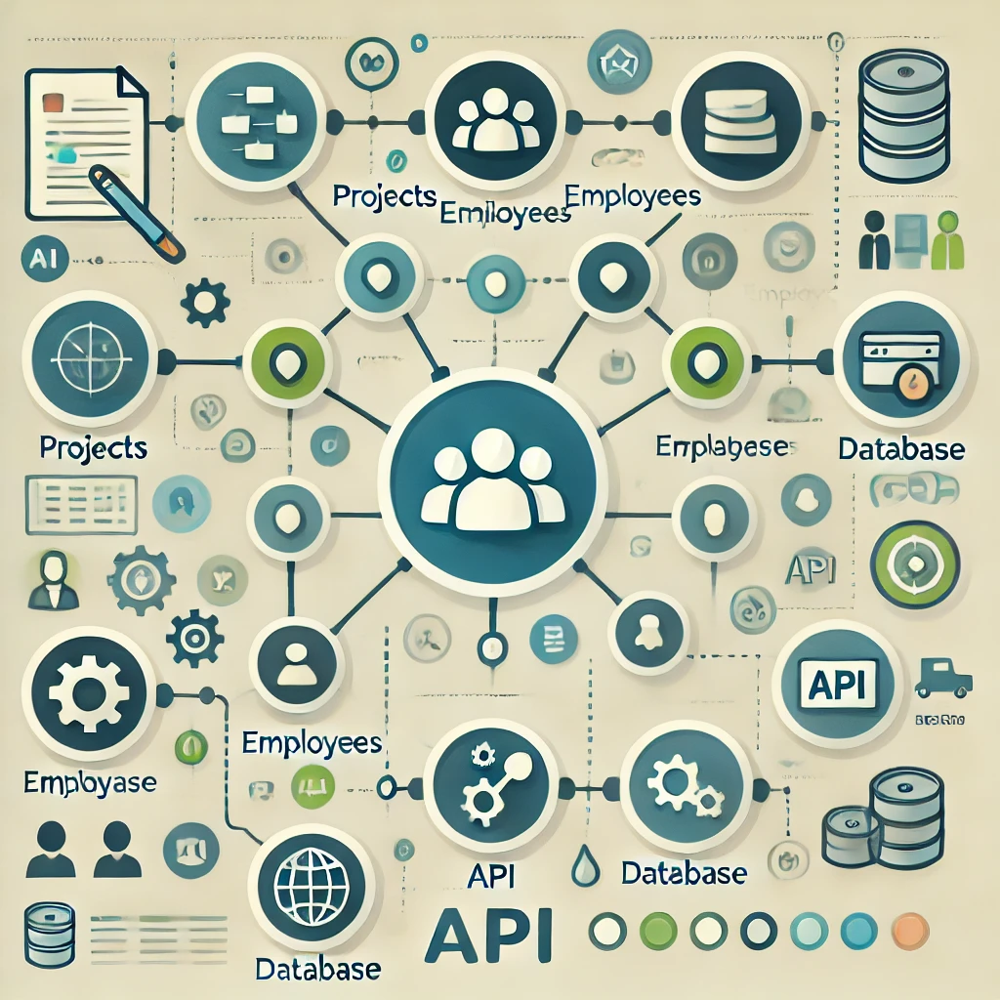
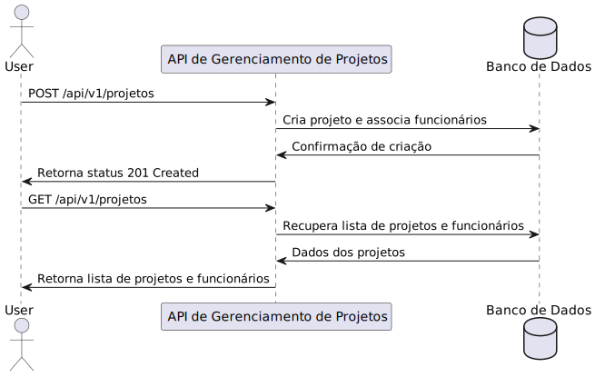

# API de Gerenciamento de Projetos



## Descrição
Esta API permite a criação e listagem de projetos, bem como o gerenciamento de funcionários associados a cada projeto. Cada projeto pode ter vários funcionários e cada funcionário pode estar associado a vários projetos.

### Funcionalidades:
- Criar um novo projeto com funcionários
- Listar todos os projetos com seus respectivos funcionários

## Tecnologias Utilizadas
- Java 21
- Spring Boot 3.3.5
- PostgreSQL
- Docker e Docker Compose

## Configuração do Ambiente
Para configurar e executar a API localmente, certifique-se de que o [Docker](https://www.docker.com/) esteja instalado e em execução.

### Passo a Passo

1. Clone o repositório:
   ```bash
   git clone https://github.com/flavioCoder/desafio-project-management.git
   cd desafio-project-management
2. Configure as variáveis de ambiente para o PostgreSQL no arquivo docker-compose.yml:
   ```
   environment:
   POSTGRES_DB: project_employee_db
   POSTGRES_USER: postgres
   POSTGRES_PASSWORD: paassword
3. Execute o Docker comppose:
   ```
   docker-compose up --build


# Endpoints Principais

## Criar um Projeto
- Autenticação: Bearer token no cabeçalho Authorization.
```
POST /api/v1/projetos
```
- Request Body: Request com as informações do projeto e dos funcionários associados.
```
{
  "nome": "nomeDoProjeto",
  "funcionarios": [
    {
      "nome": "nomeDoFuncionario",
      "cpf": "XXX.XXX.XXX-XX",
      "email": "algumemail@dominio.com",
      "salario": XXXXX.XX
    },
    {
      "nome": "nomeDoFuncionario",
      "cpf": "XXX.XXX.XXX-XX",
      "email": "algumemail@dominio.com",
      "salario": XXXXX.XX
    }
  ]
}
```
- Response Body: JSON com as informações do projeto e dos funcionários associados.
```
{
  "id": "UUID",
  "nome": "nomeDoProjeto",
  "data_criacao": "data",
  "funcionarios": [
      {
        "nome": "nomeDoFuncionario",
        "cpf": "XXX.XXX.XXX-XX",
        "email": "algumemail@dominio.com",
        "salario": XXXXX.XX
    },
    {
      "nome": "nomeDoFuncionario",
      "cpf": "XXX.XXX.XXX-XX",
      "email": "algumemail@dominio.com",
      "salario": XXXXX.XX
    }
  ]
}
```
## Listar Projetos
- Autenticação: Bearer token no cabeçalho Authorization.
```
GET /api/v1/projetos
```
- Response Body: JSON com a lista de projetos e funcionários.
```
[
	{
		"id": "4a105305-4918-405b-b5de-7e8c2230d5f5",
		"nome": "Orla",
		"data_criacao": "2024-11-12T02:16:07.797",
		"funcionarios": [
			{
				"id": "23a811e2-6084-40e6-9cb2-e14e45cd89d1",
				"nome": "Caio",
				"cpf": "139.881.977-85",
				"email": "caio2@example.com",
				"salario": 19500.00
			},
			{
				"id": "73cc3641-04d7-4876-9513-22afa15c476c",
				"nome": "Flavio",
				"cpf": "139.881.977-85",
				"email": "flavio12@example.com",
				"salario": 14000.00
			}
		]
	},
	{
		"id": "e3aa22cf-d5a9-4e4a-a545-d991979ecff9",
		"nome": "CCXP24",
		"data_criacao": "2024-11-12T02:17:46.443",
		"funcionarios": [
			{
				"id": "1fc5e964-e5b4-468a-b3da-6865509a72fc",
				"nome": "Caio",
				"cpf": "139.881.977-85",
				"email": "caio2@example.com",
				"salario": 19500.00
			},
			{
				"id": "d805b97e-c46d-4e99-b5b1-5495c291a006",
				"nome": "Flavio",
				"cpf": "139.881.977-85",
				"email": "flavio12@example.com",
				"salario": 14000.00
			}
		]
	}
]
```

# Desenho do Fluxo



# Estrutura das Entidades

## Projeto
- id: Identificador único (UUID)
- nome: Nome do projeto
- data_criacao: Data de criação do projeto
- funcionarios: Lista de funcionários associados ao projeto

## Funcionario

- id: Identificador único (UUID)
- nome: Nome do funcionário
- cpf: CPF do funcionário
- email: E-mail do funcionário
- salario: Salário do funcionário

# Para ver o OpenAPI  3.0.1 do App
```
docs -> openapi.yaml
```
